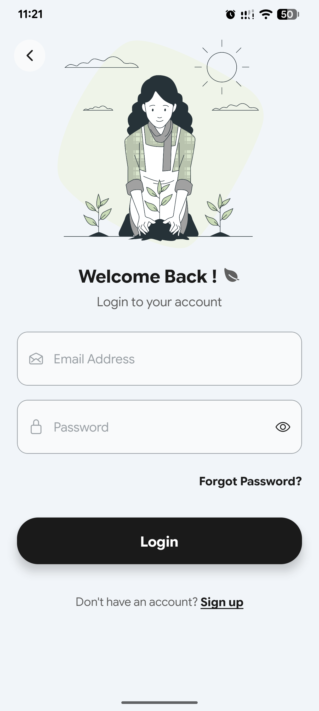
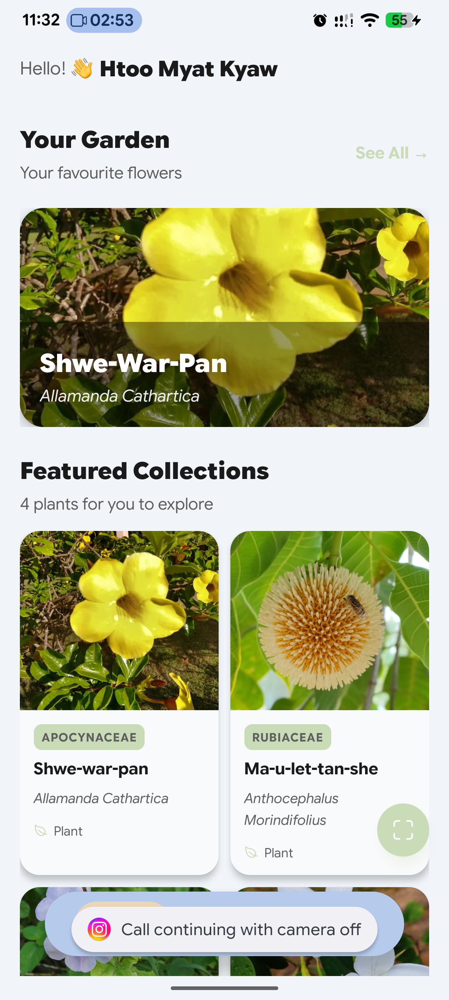
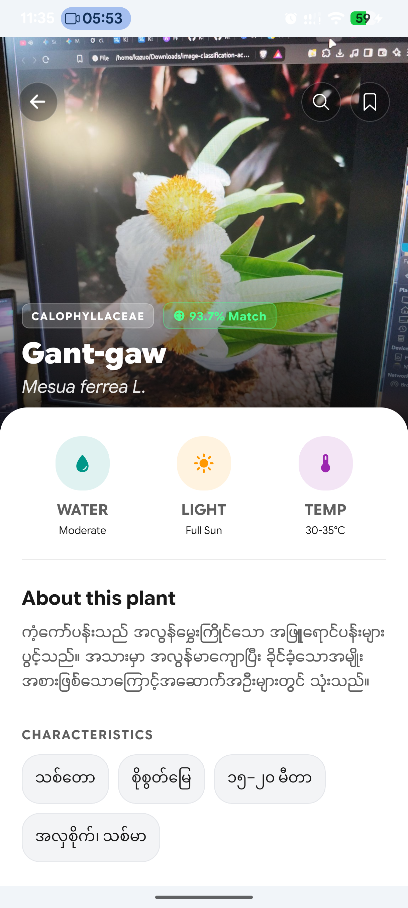
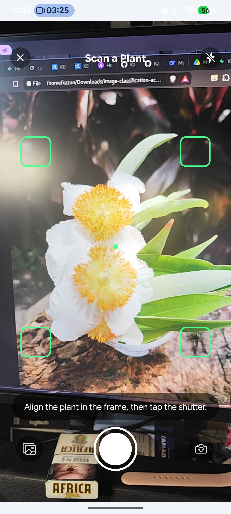
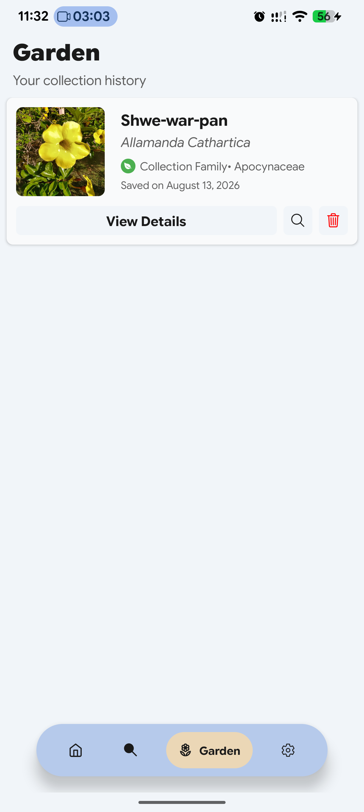
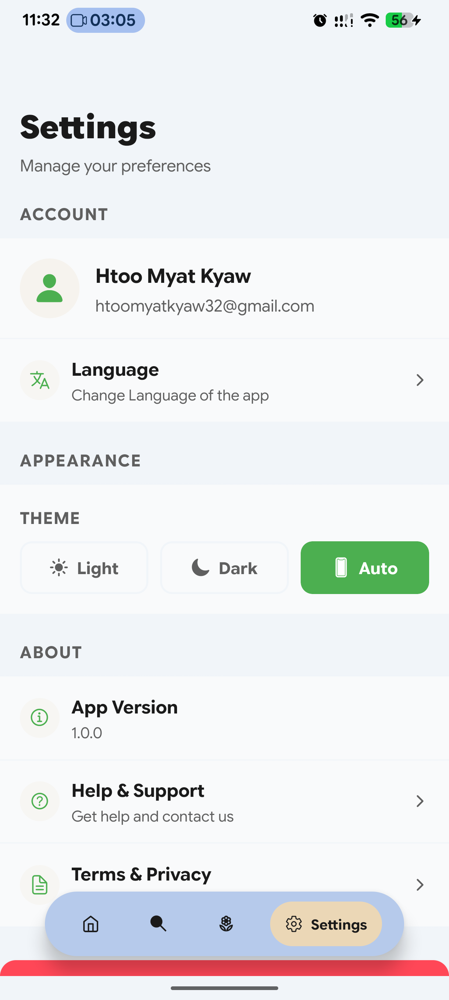
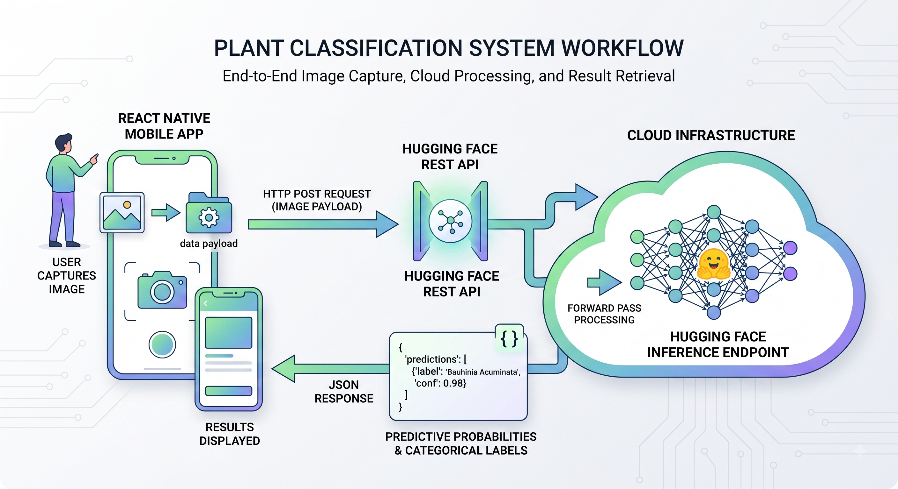

# 🌿 Mya Khwar Nyo (မြခွာညို) - AI-Based Plant Classification System

> An end-to-end computer vision system for real-time plant and flower species identification, designed for the University of Yangon botanical academic context.


**Mya Khwar Nyo** is a cross-platform mobile application that leverages advanced Deep Learning architectures to instantly identify 37 distinct plant and flower species. Built as a Final Year Capstone/Bachelor's Thesis project, it features a decoupled client-server architecture to ensure lightweight, real-time edge performance.

---

## ✨ Key Features

* 📸 **Real-Time Classification:** Snap a photo or upload from the gallery for instant inference.
* 🧠 **State-of-the-Art AI:** Powered by a highly optimized Swin Transformer model (achieving 94.0% accuracy), with fallback YOLOv8 and ConvNeXt pipelines.
* 📚 **Rich Botanical Data:** Detailed taxonomic profiles, characteristics, and optimal care tips (water, light, temperature) for each detected species.
* 🌍 **Bilingual Support:** Seamlessly toggle between English and Burmese (Myanmar) interfaces.
* 🪴 **Personal Garden History:** Save your botanical discoveries to a personal collection history, securely synced to the cloud.
* 🔍 **Quick Research:** Integrated direct Google Search routing for further species exploration.
* 🌙 **Adaptive UI:** Clean, glassmorphism-inspired design with Dark Mode support for authentication screens.

---

## 📱 App Interface

| Authentication & Onboarding | Home  | Plant Details & Taxonomy |
| :---: | :---: | :---: |
|  |  |  |

| Scan & Inference | Garden / Collection History | App Settings |
| :---: | :---: | :---: |
|  |  |  |

---

## 🏗️ System Architecture & Tech Stack

The system utilizes a decoupled, client-server paradigm to maintain scalability and stateless communication.



### **Frontend (Mobile Client)**
* **Framework:** React Native / Expo
* **Features:** Native camera integration, async REST API client, state-driven navigation.

### **Backend (Cloud & API)**
* **API Framework:** FastAPI (Python)
* **Database & Auth:** Supabase (PostgreSQL) for user management and structured botanical data storage.
* **Hosting:** Hugging Face Inference Endpoints for containerized, scalable model deployment.

### **Machine Learning Pipeline**
* **Primary Engine:** Swin Transformer (Shifted-Window Vision Transformer)
* **Baseline/Fallback Models:** YOLOv8, ConvNeXt-Tiny, ResNet-50
* **Framework:** PyTorch
* **Dataset:** 210 curated, localized high-quality images across 37 classes, heavily augmented (spatial, color-space) to prevent overfitting.

---

## 🚀 Getting Started

### Prerequisites
* Node.js & npm/Yarn
* Expo CLI (`npm install -g expo-cli`)
* Android Studio (for Android Emulator) or Xcode (for iOS Simulator)
* Python 3.10+ (for local backend testing)

### Installation

**1. Clone the repository**
```bash
git clone https://github.com/Kazuo-Mikara/MyaKhwarNyo.git
cd MyaKhwarNyo
```

**2. Install Frontend Dependencies**
```bash
npm install
```

**3. Configure Environment Variables**
```bash
Create a .env file in the root directory and add your keys:
EXPO_PUBLIC_SUPABASE_URL=your_supabase_url
EXPO_PUBLIC_SUPABASE_KEY=your_supabase_anon_key
EXPO_PUBLIC_HF_ENDPOINT=your_huggingface_api_endpoint
```

**4. Run the App**
```bash
npx expo run:android
# or
npx expo run:ios
```
## If you want to explore how the backend is built, please refer to the [MyaKhwarNyo - Backend](https://github.com/Kazuo-Mikara/MyaKhwarNyo_backend.git).


## 🔬 Model Performance Metrics

Our models were rigorously trained using a two-stage transfer learning protocol. Below are the final evaluation results on the localized test dataset:

Architecture | Paradigm | Overall Accuracy | Precision | Recall | F1-Score 
------------|-----------|------------------|-----------|--------|---------  
Swin-T | Attention-Based | 94.0% | 93.8% | 93.5% | 93.6%  
ConvNeXt-T | Modern CNN | 91.0% | 90.8% | 90.4% | 90.6%  
ResNet-50 | Residual CNN | 90.0% | 89.5% | 89.2% | 89.3%  

## 🤝 Acknowledgments

Developed as a partial fulfillment of the requirements for the Degree of Bachelor of Science in Computer Science at the University of Yangon (December 2026).

Special thanks to the Department of Computer Studies.